# ER Diagram - BetaTasker Database Schema

## Entity Relationship Diagram

```mermaid
erDiagram
    %% Core User Management
    User {
        uint ID PK
        string Username UK
        string Email UK
        string PasswordHash
        string Role
        time CreatedAt
        time UpdatedAt
        bool IsActive
        string Factor
        string Process
        string EvaluationAxis
        string InformationAmount
    }

    %% Task Management
    Task {
        int ID PK
        int UserID FK
        int MemoryID FK
        string Title
        string Description
        time Date
        string Status
        int Priority
        time CreatedAt
        time UpdatedAt
    }

    %% Assessment System
    Assessment {
        int ID PK
        int TaskID FK
        int UserID FK
        int EffectivenessScore
        int EffortScore
        int ImpactScore
        string QualitativeFeedback
        time CreatedAt
        time UpdatedAt
    }

    %% Memory System
    Memory {
        int ID PK
        int UserID FK
        string SourceType
        string Title
        string Author
        string Notes
        string Tags
        string ReadStatus
        time ReadDate
        string Factor
        string Process
        string EvaluationAxis
        string InformationAmount
        time CreatedAt
        time UpdatedAt
    }

    %% Memory Context System
    MemoryContext {
        int ID PK
        int UserID FK
        int TaskID FK
        int Level
        string WorkTarget
        string Machine
        string MaterialSpec
        string ChangeFactor
        string Goal
        time CreatedAt
    }

    TechnicalFactor {
        int ID PK
        int ContextID FK
        string ToolSpec
        string EvalFactors
        string MeasurementMethod
        string Concern
        time CreatedAt
    }

    KnowledgeTransformation {
        int ID PK
        int ContextID FK
        string Transformation
        string Countermeasure
        string ModelFeedback
        string LearnedKnowledge
        time CreatedAt
    }

    %% Heuristics System
    HeuristicsAnalysis {
        uint ID PK
        uint UserID FK
        uint TaskID FK
        string AnalysisType
        string Result
        float64 Score
        string Status
        time CreatedAt
        time UpdatedAt
        time DeletedAt
    }

    HeuristicsTracking {
        uint ID PK
        uint UserID FK
        string Action
        string Context
        string SessionID
        time Timestamp
        int Duration
        time CreatedAt
        time UpdatedAt
        time DeletedAt
    }

    HeuristicsInsight {
        uint ID PK
        uint UserID FK
        string Type
        string Title
        string Description
        float64 Confidence
        string Data
        bool IsActive
        time CreatedAt
        time UpdatedAt
        time DeletedAt
    }

    HeuristicsPattern {
        uint ID PK
        string Name
        string Category
        string Pattern
        int Frequency
        float64 Accuracy
        time LastSeen
        time CreatedAt
        time UpdatedAt
        time DeletedAt
    }

    HeuristicsModel {
        uint ID PK
        string ModelType
        string Version
        string Parameters
        string Performance
        string Status
        time TrainedAt
        time CreatedAt
        time UpdatedAt
        time DeletedAt
    }

    %% Knowledge Pattern System
    KnowledgePattern {
        string ID PK
        string Type
        string Domain
        string TacitKnowledge
        string ExplicitForm
        string ConversionPath
        float64 Accuracy
        float64 Coverage
        float64 Consistency
        string AbstractLevel
        time CreatedAt
        time UpdatedAt
        time DeletedAt
    }

    %% Language Optimization
    LanguageOptimization {
        string ID PK
        int TaskID FK
        string OriginalText
        string OptimizedText
        string Domain
        string AbstractionLevel
        float64 Precision
        float64 Clarity
        float64 Completeness
        string Context
        string Transformation
        float64 EvaluationScore
        time CreatedAt
        time UpdatedAt
        time DeletedAt
    }

    %% Process Optimization
    ProcessOptimization {
        string ID PK
        string ProcessID
        string OptimizationType
        string InitialState
        string OptimizedState
        float64 Improvement
        string Method
        int Iterations
        float64 ConvergenceTime
        string ValidatedBy
        time ValidationDate
        time CreatedAt
        time UpdatedAt
        time DeletedAt
    }

    %% Labeling System
    QualitativeLabel {
        string ID PK
        int TaskID FK
        uint UserID FK
        string Content
        string Category
        time CreatedAt
        time UpdatedAt
    }

    QuantificationLabel {
        string ID PK
        uint UserID FK
        int TaskID FK
        string OriginalText
        string NormalizedText
        string Category
        string Context
        string Domain
        string ImageURL
        string ThumbnailURL
        string ImageDescription
        string ImageMetadata
        float64 Value
        string Unit
        float64 MinRange
        float64 MaxRange
        float64 TypicalValue
        int Precision
        float64 Confidence
        string AbstractLevel
        string CulturalContext
        string TemporalContext
        string SpatialContext
        string RelatedConcepts
        string SemanticTags
        float64 Accuracy
        float64 Consistency
        float64 Reproducibility
        float64 Usability
        int VerificationCount
        time LastVerified
        string Source
        bool Validated
        bool PublicVisibility
        string Tags
        string Notes
        int Version
        string CreatedBy
        string UpdatedBy
        time CreatedAt
        time UpdatedAt
        time DeletedAt
    }

    ImageAnnotation {
        string ID PK
        string LabelID FK
        string Type
        float64 X
        float64 Y
        float64 Width
        float64 Height
        string Label
        float64 Value
        string Unit
        float64 Confidence
        string CreatedBy
        time CreatedAt
    }

    LabelRevision {
        string ID PK
        string LabelID FK
        int Version
        string Changes
        string Comment
        string UserID
        time Timestamp
    }

    LabelDataset {
        string ID PK
        string Name
        string Description
        string Domain
        int TotalLabels
        int VerifiedLabels
        float64 AverageAccuracy
        float64 Completeness
        float64 Consistency
        float64 Diversity
        float64 Balance
        string Version
        string License
        string Citation
        string CreatedBy
        time CreatedAt
        time UpdatedAt
        time DeletedAt
    }

    LabelRelation {
        string ID PK
        string SourceID FK
        string TargetID FK
        string RelationType
        float64 Strength
        bool Bidirectional
        string Context
        float64 Confidence
        time CreatedAt
    }

    VisualMetaphor {
        string ID PK
        string Metaphor
        string ReferenceObject
        float64 Width
        float64 Height
        float64 Depth
        string ImageURL
        float64 MinVariability
        float64 MaxVariability
        time CreatedAt
        time UpdatedAt
    }

    UserCalibration {
        string ID PK
        uint UserID FK
        string ReferenceObject
        string Measurements
        string ImageURL
        float64 Confidence
        time CreatedAt
        time UpdatedAt
    }

    %% Multimodal Data
    MultimodalData {
        string ID PK
        uint UserID FK
        uint TaskID FK
        string Text
        string Tokens
        string SemanticVector
        float64 AmbiguityScore
        string ImageURL
        string Objects
        string Measurements
        float64 ImageConfidence
        string MappingType
        float64 CorrelationScore
        float64 ContextRelevance
        float64 HistoricalAccuracy
        float64 Value
        string Unit
        float64 MinRange
        float64 MaxRange
        float64 Confidence
        bool Verified
        string UserFeedback
        time CreatedAt
        time UpdatedAt
    }

    %% Teaching Free Control
    TeachingFreeControl {
        string ID PK
        int TaskID FK
        string RobotID
        string TaskType
        string VisionSystem
        string ForceControl
        string AIModel
        string LearningData
        float64 SuccessRate
        float64 AdaptationTime
        string ErrorRecovery
        string PerformanceLog
        time CreatedAt
        time UpdatedAt
        time DeletedAt
    }

    %% Phenomenological Framework
    PhenomenologicalFramework {
        string ID PK
        int TaskID FK
        string Name
        string Description
        string Goal
        string Scope
        string Process
        string Result
        string Feedback
        float64 LimitMin
        float64 LimitMax
        string GoalFunction
        string AbstractLevel
        string Domain
        time CreatedAt
        time UpdatedAt
        time DeletedAt
    }

    %% State Evaluation System
    StateEvaluation {
        string ID PK
        string UserID FK
        int TaskID FK
        int Level
        string WorkTarget
        string CurrentState
        string TargetState
        float64 EvaluationScore
        string Framework
        string Tools
        string ProcessData
        string Results
        string LearnedKnowledge
        string Status
        time CreatedAt
        time UpdatedAt
    }

    ToolMatchingResult {
        string ID PK
        string StateEvaluationID FK
        string RobotID
        string OptimizationModelID FK
        float64 MatchingScore
        string Recommendations
        string Parameters
        string ExpectedPerformance
        time CreatedAt
    }

    ProcessMonitoring {
        string ID PK
        string StateEvaluationID FK
        string ProcessType
        string MonitoringData
        string Metrics
        string Anomalies
        string Status
        time StartTime
        time EndTime
        time CreatedAt
        time UpdatedAt
    }

    LearningPattern {
        string ID PK
        string UserID FK
        string PatternType
        string Domain
        string TacitKnowledge
        string ExplicitForm
        string SECIStage
        string Method
        float64 Accuracy
        float64 Coverage
        float64 Consistency
        string AbstractLevel
        bool Validated
        time CreatedAt
        time UpdatedAt
    }

    %% Optimization Model
    OptimizationModel {
        string ID PK
        string Name
        string Type
        string ObjectiveFunction
        string Constraints
        string Parameters
        string PerformanceMetric
        float64 IterationCount
        float64 ConvergenceRate
        string Domain
        string Application
        time CreatedAt
        time UpdatedAt
    }

    %% Book System
    Book {
        int ID PK
        string Title
        string Name
        string Text
        string Disc
        string ImgPath
        string Status
    }

    %% Relationships
    User ||--o{ Task : "creates"
    User ||--o{ Assessment : "performs"
    User ||--o{ Memory : "owns"
    User ||--o{ MemoryContext : "creates"
    User ||--o{ HeuristicsAnalysis : "generates"
    User ||--o{ HeuristicsTracking : "tracks"
    User ||--o{ HeuristicsInsight : "receives"
    User ||--o{ QualitativeLabel : "creates"
    User ||--o{ QuantificationLabel : "creates"
    User ||--o{ MultimodalData : "generates"
    User ||--o{ UserCalibration : "calibrates"
    User ||--o{ StateEvaluation : "evaluates"
    User ||--o{ LearningPattern : "learns"

    Task ||--o{ Assessment : "evaluated_by"
    Task ||--o{ MemoryContext : "has_context"
    Task ||--o{ HeuristicsAnalysis : "analyzed_by"
    Task ||--o{ QualitativeLabel : "labeled_by"
    Task ||--o{ QuantificationLabel : "quantified_by"
    Task ||--o{ MultimodalData : "has_data"
    Task ||--o{ LanguageOptimization : "optimized_by"
    Task ||--o{ TeachingFreeControl : "controlled_by"
    Task ||--o{ PhenomenologicalFramework : "framed_by"
    Task ||--o{ StateEvaluation : "evaluated_in"

    Memory ||--o{ Task : "referenced_by"

    MemoryContext ||--o{ TechnicalFactor : "has_factors"
    MemoryContext ||--o{ KnowledgeTransformation : "transforms"

    QuantificationLabel ||--o{ ImageAnnotation : "annotated_by"
    QuantificationLabel ||--o{ LabelRevision : "revised_by"
    QuantificationLabel }o--o{ LabelDataset : "belongs_to"
    QuantificationLabel ||--o{ LabelRelation : "relates_to"

    StateEvaluation ||--o{ ToolMatchingResult : "matches_tools"
    StateEvaluation ||--o{ ProcessMonitoring : "monitored_by"

    OptimizationModel ||--o{ ToolMatchingResult : "matched_by"
```

## Entity Descriptions

### Core Entities

1. **User** - Central user management entity with authentication and profile information
2. **Task** - Main task entity that users create and manage
3. **Assessment** - Task evaluation and scoring system
4. **Memory** - Knowledge storage and retrieval system

### Advanced AI/ML Entities

5. **HeuristicsAnalysis** - AI analysis results and insights
6. **HeuristicsTracking** - User behavior tracking for ML
7. **HeuristicsInsight** - Generated insights from analysis
8. **HeuristicsPattern** - Detected behavioral patterns
9. **HeuristicsModel** - ML model information and performance

### Knowledge Management

10. **KnowledgePattern** - Tacit to explicit knowledge conversion patterns
11. **LanguageOptimization** - Text optimization and improvement
12. **ProcessOptimization** - Workflow and process improvement tracking

### Labeling and Annotation System

13. **QualitativeLabel** - Text-based qualitative labels
14. **QuantificationLabel** - Quantitative measurement labels with rich metadata
15. **ImageAnnotation** - Visual annotations on images
16. **LabelRevision** - Version control for label changes
17. **LabelDataset** - Collections of labels for ML training
18. **LabelRelation** - Relationships between different labels
19. **VisualMetaphor** - Visual reference objects for calibration
20. **UserCalibration** - User-specific calibration data

### Multimodal and Context

21. **MultimodalData** - Combined text and image processing data
22. **MemoryContext** - Contextual information for tasks
23. **TechnicalFactor** - Technical specifications and constraints
24. **KnowledgeTransformation** - Knowledge conversion processes

### Control and Framework

25. **TeachingFreeControl** - Autonomous robot control without teaching
26. **PhenomenologicalFramework** - GAPR framework implementation
27. **StateEvaluation** - Process state evaluation and monitoring
28. **ToolMatchingResult** - Tool recommendation results
29. **ProcessMonitoring** - Real-time process monitoring
30. **LearningPattern** - Learned behavioral patterns
31. **OptimizationModel** - Mathematical optimization models

### Content Management

32. **Book** - Content and resource management

## Key Relationships

- **User** is the central entity with one-to-many relationships to most other entities
- **Task** serves as a hub connecting various analysis, labeling, and optimization systems
- **QuantificationLabel** has the most complex structure with multiple related entities for comprehensive labeling
- **Heuristics*** entities form a complete ML/AI analysis pipeline
- **StateEvaluation** and related entities provide process monitoring and optimization capabilities
- **MemoryContext** and related entities support contextual knowledge management

## Database Features

- **Soft Deletes**: Many entities support soft deletion with `DeletedAt` fields
- **JSON Fields**: Extensive use of JSONB for flexible data storage
- **Audit Trails**: CreatedAt, UpdatedAt timestamps on most entities
- **Version Control**: Label revision system for tracking changes
- **Multimodal Support**: Combined text and image processing capabilities
- **ML Integration**: Comprehensive support for machine learning workflows
