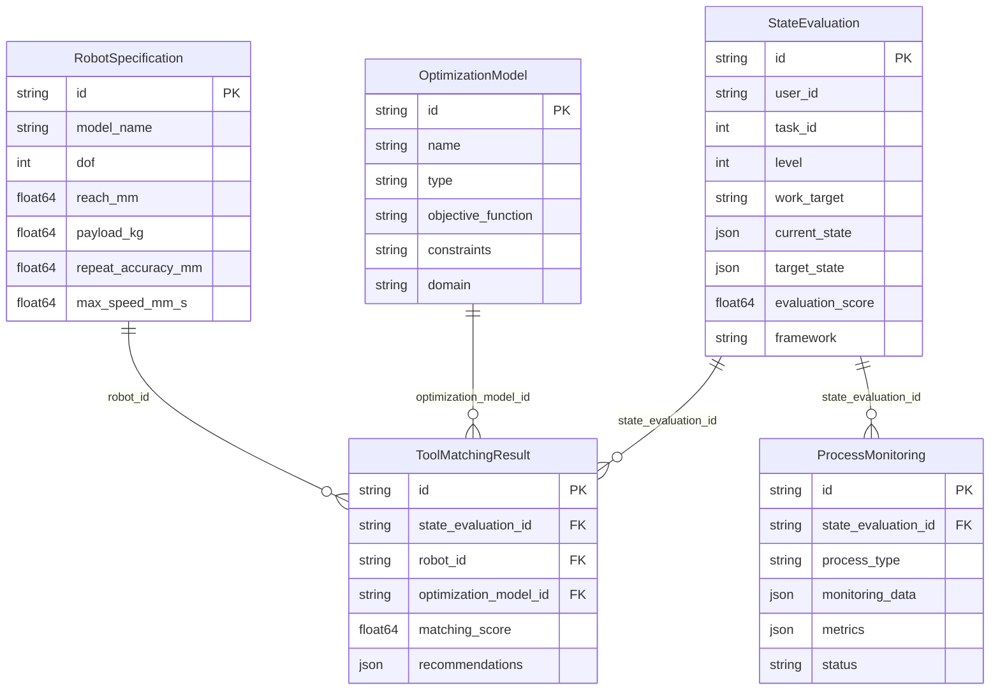

# 🌱 BetaTasker Seed Data 完全ガイド

betaTaskerプロジェクトの包括的なseedデータシステムの完全な説明書です。

## 📋 目次

1. [概要](#概要)
2. [データ構造](#データ構造)
3. [Seedデータ詳細](#seedデータ詳細)
4. [使用方法](#使用方法)
5. [データ関係図](#データ関係図)
6. [カスタマイズガイド](#カスタマイズガイド)
7. [トラブルシューティング](#トラブルシューティング)

## 概要

betaTaskerのseedデータシステムは、製造業・ロボティクス分野における状態評価、ツールマッチング、プロセス監視、学習パターンを統合した包括的なデータベース初期化システムです。

### 🎯 主要機能

- **状態評価システム**: L1-L5レベルの技能評価とスコアリング
- **ツールマッチング**: ロボット・最適化モデルの最適組み合わせ選択
- **プロセス監視**: リアルタイム製造プロセスの監視とアラート
- **学習パターン**: SECIモデルに基づく知識転換パターン

## データ構造

### Core Models

#### 1. StateEvaluation（状態評価）
```go
type StateEvaluation struct {
    ID               string    // UUID
    UserID          string    // ユーザー識別子
    TaskID          int       // タスクID
    Level           int       // 技能レベル (1-5)
    WorkTarget      string    // 作業対象の詳細説明
    CurrentState    JSON      // 現在の状態 (accuracy, efficiency, etc.)
    TargetState     JSON      // 目標状態
    EvaluationScore float64   // 評価スコア (0-100)
    Framework       string    // 使用する現象学的フレームワーク
    Tools           JSON      // 使用機材・工具情報
    ProcessData     JSON      // プロセスデータ
    Results         JSON      // 結果データ
    LearnedKnowledge string   // 獲得した知識
    Status          string    // pending, running, completed
}
```

#### 2. RobotSpecification（ロボット仕様）
```go
type RobotSpecification struct {
    ID                      string   // ロボットID
    ModelName              string   // モデル名
    DOF                    int      // 自由度
    ReachMm                float64  // 到達範囲(mm)
    PayloadKg              float64  // ペイロード(kg)
    RepeatAccuracyMm       float64  // 繰り返し精度(mm)
    MaxSpeedMmS            float64  // 最大速度(mm/s)
    VisionSystem           string   // 視覚システム
    AICapability           string   // AI機能
    SafetyFeatures         string   // 安全機能
}
```

#### 3. OptimizationModel（最適化モデル）
```go
type OptimizationModel struct {
    ID               string   // モデルID
    Name             string   // モデル名
    Type             string   // タイプ (control_theory, ml_based, etc.)
    ObjectiveFunction string  // 目的関数
    Constraints      string   // 制約条件
    Parameters       string   // パラメータ
    PerformanceMetric string  // 性能指標
    IterationCount   float64  // 反復回数
    ConvergenceRate  float64  // 収束率
    Domain           string   // 適用領域
    Application      string   // 応用分野
}
```

## Seedデータ詳細

### 🤖 ロボット仕様データ（21種類）

#### 教示フリーロボット
```
TF-ARM-001: 教示フリーアーム
- DOF: 6軸, Reach: 850mm, Payload: 5kg
- 精度: 0.02mm, 速度: 1000mm/s
- 特徴: 視覚システム、6DOF力センサ、強化学習
```

#### 協働ロボット
```
COBOT-2024: 協働ロボット
- DOF: 7軸, Reach: 1200mm, Payload: 10kg
- 精度: 0.01mm, 速度: 2000mm/s
- 特徴: 人間検知、ISO10218準拠、深層学習
```

#### 高精度ロボット
```
MICRO-100: 精密アーム
- DOF: 6軸, Reach: 300mm, Payload: 1kg
- 精度: 0.005mm, 速度: 500mm/s
- 特徴: 顕微鏡カメラ、精密力制御、視覚誘導
```

### 🔧 最適化モデル（21種類）

#### 軌道最適化
```yaml
trajectory_optimization:
  目的: minimize(time) + minimize(energy)
  制約: 衝突回避、関節制限、特異点回避
  パラメータ: max_velocity:1000, max_acceleration:5000
  性能: 平均改善25.5%, 計算時間0.15s
  収束率: 95%
```

#### エネルギー最適化
```yaml
energy_optimization:
  目的: minimize(energy_consumption)
  制約: サイクル時間3.0s以下、精度0.02mm以上
  パラメータ: learning_rate:0.001, batch_size:32
  性能: エネルギー削減32%, 性能維持
  収束率: 98%
```

### 📊 状態評価サンプルデータ

#### L1レベル：初品確認
```yaml
Level1_BasicMachining:
  作業内容: "[MA-C-01] 初品加工・基本寸法確認"
  現在状態:
    accuracy: 0.75
    efficiency: 0.68
    consistency: 0.72
    innovation: 0.45
  目標状態:
    accuracy: 0.85
    efficiency: 0.75
    consistency: 0.80
    innovation: 0.55
  評価スコア: 67.5
  獲得知識: "基本的な切削条件とバリ発生の関係を理解"
```

#### L3レベル：高精度加工
```yaml
Level3_PrecisionMachining:
  作業内容: "[MA-H-03] 真円度0.005mm以下の高精度加工"
  現在状態:
    accuracy: 0.88
    efficiency: 0.85
    consistency: 0.86
    innovation: 0.78
  目標状態:
    accuracy: 0.95
    efficiency: 0.90
    consistency: 0.92
    innovation: 0.85
  評価スコア: 84.2
  獲得知識: "熱変形の予測モデル構築の重要性を認識"
```

### 🔄 学習パターン（SECIモデル）

#### 組立技能パターン
```yaml
assembly_skill_pattern:
  暗黙知: "熟練工の『しっくりくる』感覚"
  形式知: "力覚センサ値: Fx<0.5N Fy<0.5N Tz<0.1Nm"
  SECI段階: "共同化→表出化→連結化→内面化"
  方法: "力覚データ記録→パターン分析→閾値設定"
  精度: 85%
  一貫性: 90%
```

#### 品質検査パターン
```yaml
quality_inspection_pattern:
  暗黙知: "検査員の違和感察知"
  形式知: "異常検知アルゴリズム: Isolation Forest threshold=0.05"
  SECI段階: "共同化→表出化→連結化"
  方法: "異常サンプル収集→特徴量抽出→モデル学習"
  精度: 94%
  一貫性: 96%
```

## 使用方法

### 1. 基本的なSeed実行

```bash
# 基本のseed実行
go run main.go seed

# 出力例
2024/01/15 10:00:00 Starting database seeding...
2024/01/15 10:00:01 Seeding memory contexts...
2024/01/15 10:00:01 ✓ Memory contexts seeded successfully
2024/01/15 10:00:02 Seeding CSV data...
2024/01/15 10:00:02 ✓ Successfully seeded 21 robot specifications
2024/01/15 10:00:02 ✓ Successfully seeded 21 optimization models
2024/01/15 10:00:02 ✓ Successfully seeded 5 state evaluations
2024/01/15 10:00:02 Database seeding completed successfully!
```

### 2. クリーンアップ後のSeed

```bash
# データベースクリーンアップ後のseed
go run main.go clean-seed

# 出力例
2024/01/15 10:00:00 Cleaning database tables...
2024/01/15 10:00:01 ✓ Database cleaned
2024/01/15 10:00:01 Starting database seeding...
...
```

### 3. プログラムからのSeed実行

```go
import "github.com/godotask/seed"

func main() {
    model.InitDB()
    
    // 全Seedデータの実行
    if err := seed.RunAllSeeds(); err != nil {
        log.Fatalf("Seeding failed: %v", err)
    }

    // または個別実行
    if err := seed.SeedStateEvaluations(model.DB); err != nil {
        log.Fatalf("State evaluation seeding failed: %v", err)
    }
}
```

## データ関係図



## カスタマイズガイド

### 新しいロボット仕様の追加

1. **CSVファイル編集**
```csv
id,model_name,dof,reach_mm,payload_kg,repeat_accuracy_mm,max_speed_mm_s,work_envelope_shape,teaching_method,control_type,vision_system,force_sensor,ai_capability,safety_features,maintenance_interval_hours
custom_robot_001,カスタムロボット,6,1000.0,15.0,0.01,1800.0,spherical,ai,adaptive,stereo_camera,6DOF_sensor,deep_learning,collision_detection,2500
```

2. **プログラムから追加**
```go
robot := model.RobotSpecification{
    ID:              "custom_robot_001",
    ModelName:       "カスタムロボット",
    DOF:            6,
    ReachMm:        1000.0,
    PayloadKg:      15.0,
    RepeatAccuracyMm: 0.01,
    MaxSpeedMmS:    1800.0,
    // ... その他のフィールド
}
db.Create(&robot)
```

### 新しい評価パターンの追加

```go
evaluation := model.StateEvaluation{
    ID:         uuid.New().String(),
    UserID:     "user_custom",
    TaskID:     999,
    Level:      3,
    WorkTarget: "[カスタム] 特殊加工技術",
    CurrentState: datatypes.JSON(`{
        "accuracy": 0.80,
        "efficiency": 0.75,
        "consistency": 0.85,
        "innovation": 0.70
    }`),
    TargetState: datatypes.JSON(`{
        "accuracy": 0.90,
        "efficiency": 0.85,
        "consistency": 0.90,
        "innovation": 0.80
    }`),
    EvaluationScore: 77.5,
    // ... その他のフィールド
}
```

### カスタムSeed関数の作成

```go
func SeedCustomData(db *gorm.DB) error {
    log.Println("Seeding custom data...")
    
    // カスタムデータの定義
    customData := []YourModel{
        // ... データ定義
    }
    
    // データベースに挿入
    for _, item := range customData {
        if err := db.Create(&item).Error; err != nil {
            return err
        }
    }
    
    log.Printf("✓ Successfully seeded %d custom items", len(customData))
    return nil
}
```

## API統合例

### 状態評価API
```bash
# 新しい評価の作成
curl -X POST http://localhost:8080/api/state-evaluations \
  -H "Content-Type: application/json" \
  -d '{
    "user_id": "user_001",
    "task_id": 1,
    "level": 2,
    "work_target": "[MA-Q-02] 材料硬度変動への対応",
    "current_state": {
      "accuracy": 0.82,
      "efficiency": 0.71,
      "consistency": 0.79,
      "innovation": 0.63
    },
    "target_state": {
      "accuracy": 0.90,
      "efficiency": 0.80,
      "consistency": 0.85,
      "innovation": 0.70
    }
  }'
```

### ツールマッチングAPI
```bash
# 最適ツールの検索
curl -X POST http://localhost:8080/api/tool-matching \
  -H "Content-Type: application/json" \
  -d '{
    "state_evaluation_id": "eval-uuid-here",
    "requirements": {
      "payload": 5.0,
      "reach": 800.0,
      "precision": 0.02,
      "speed": 1000.0
    },
    "constraints": {
      "budget": 500000,
      "space": "limited"
    }
  }'
```

## トラブルシューティング

### よくある問題

#### 1. CSVファイルが見つからない
```
Error: could not open robot_specifications.csv: no such file or directory
```
**解決方法**: `seed/data/` ディレクトリにCSVファイルが存在するか確認。ファイルがない場合はデフォルトデータが使用されます。

#### 2. 外部キー制約エラー
```
Error: FOREIGN KEY constraint failed
```
**解決方法**: `clean-seed` オプションを使用してテーブルの依存関係を正しい順序でクリア。

#### 3. 重複キーエラー
```
Error: UNIQUE constraint failed
```
**解決方法**: 既存データをクリアしてから実行するか、UUIDの生成を確認。

### デバッグ方法

#### ログレベルの調整
```go
import "log"

func main() {
    log.SetFlags(log.LstdFlags | log.Lshortfile)
    // ... seed実行
}
```

#### 個別テーブルのデータ確認
```sql
-- 状態評価データの確認
SELECT id, user_id, level, work_target, evaluation_score 
FROM state_evaluations 
ORDER BY created_at DESC;

-- ロボット仕様の確認
SELECT id, model_name, dof, payload_kg, repeat_accuracy_mm 
FROM robot_specifications;

-- ツールマッチング結果の確認
SELECT id, matching_score, robot_id, optimization_model_id 
FROM tool_matching_results;
```

## 拡張性

### 将来の拡張予定
- **多言語対応**: 英語・中国語・ドイツ語のseedデータ
- **業界特化**: 自動車・航空宇宙・医療機器特化データ
- **リアルタイム同期**: 実機データとの同期機能
- **機械学習統合**: 自動的なパターン学習・更新機能

このseedデータシステムにより、betaTaskerは実際の製造現場に即した包括的なデータベースで起動し、即座に本格的な開発・テストが可能になります。