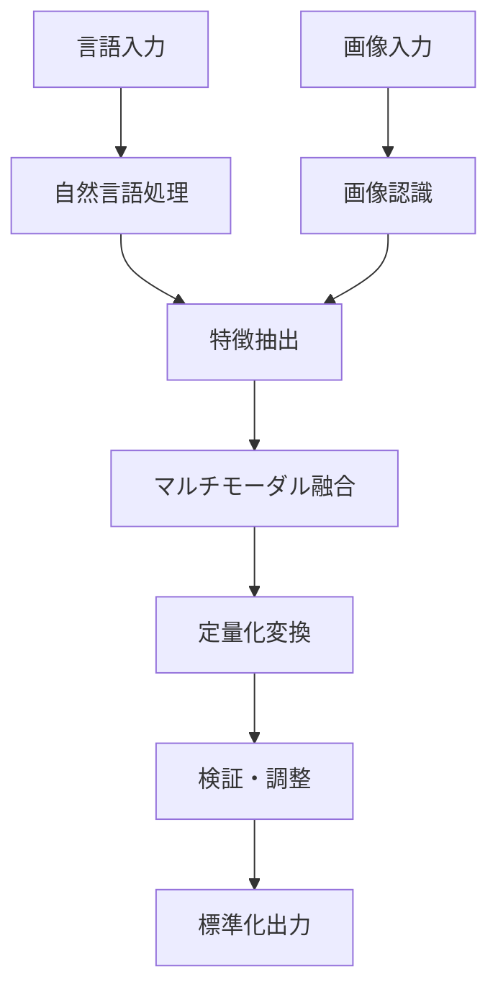

# マルチモーダル定量化フレームワーク
## 言語情報と画像の統合的定量化アプローチ

## 1. 概要

言語情報と画像情報を結びつけることで、感覚的な定量化をより正確で再現性の高いものに変換します。
「小さじ1杯」という言語表現と実際の画像を関連付けることで、個人差を最小化し、共通理解を促進します。

## 2. マルチモーダル定量化の階層

```
レベル1: 単一モーダル
├── 言語のみ: "少し多め"
├── 画像のみ: [画像データ]
└── 定量化精度: 低

レベル2: 基本的関連付け
├── 言語＋参照画像
├── 簡単なマッピング
└── 定量化精度: 中

レベル3: 相互補完
├── 言語が画像を説明
├── 画像が言語を具体化
└── 定量化精度: 高

レベル4: 統合的理解
├── コンテキスト考慮
├── 動的調整
└── 定量化精度: 最高
```

## 3. 実装アーキテクチャ

### 3.1 データ構造

```typescript
interface MultimodalQuantification {
  // 言語情報
  linguistic: {
    text: string;                    // "コップ半分くらい"
    tokens: string[];                // ["コップ", "半分", "くらい"]
    semanticVector: number[];        // 意味ベクトル
    ambiguityScore: number;          // 曖昧さスコア
  };
  
  // 画像情報
  visual: {
    imageUrl: string;                // 画像URL
    imageData: ArrayBuffer;          // 画像バイナリ
    features: {
      objects: DetectedObject[];     // 検出オブジェクト
      measurements: Measurement[];   // 測定値
      colors: ColorDistribution;     // 色分布
      patterns: Pattern[];           // パターン
    };
    confidence: number;              // 画像認識信頼度
  };
  
  // 関連付け
  association: {
    mappingType: 'direct' | 'inferred' | 'learned';
    correlationScore: number;        // 相関スコア
    contextRelevance: number;        // 文脈関連性
    historicalAccuracy: number;      // 過去の精度
  };
  
  // 定量化結果
  quantification: {
    value: number;                   // 数値
    unit: string;                    // 単位
    range: [number, number];         // 範囲
    distribution: Distribution;       // 分布
    confidence: number;              // 信頼度
  };
}
```

### 3.2 処理パイプライン



## 4. 言語-画像マッピング戦略

### 4.1 直接マッピング

```typescript
interface DirectMapping {
  linguisticPattern: string;        // "小さじ*杯"
  visualTemplate: ImageTemplate;    // 標準画像テンプレート
  quantifiedValue: {
    standard: number;                // 5.0
    unit: string;                    // "ml"
    variance: number;                // ±0.5
  };
}

// 例: 料理の分量
const cookingMappings: DirectMapping[] = [
  {
    linguisticPattern: "小さじ1杯",
    visualTemplate: {
      objectType: "teaspoon",
      fillLevel: 1.0,
      referenceImage: "/images/teaspoon_full.jpg"
    },
    quantifiedValue: {
      standard: 5.0,
      unit: "ml",
      variance: 0.5
    }
  },
  {
    linguisticPattern: "ひとつまみ",
    visualTemplate: {
      objectType: "pinch",
      gestureType: "thumb_index_finger",
      referenceImage: "/images/pinch_salt.jpg"
    },
    quantifiedValue: {
      standard: 0.5,
      unit: "g",
      variance: 0.2
    }
  }
];
```

### 4.2 推論ベースマッピング

```typescript
interface InferredMapping {
  // コンテキストから推論
  context: {
    domain: string;                  // "cooking" | "construction" | "design"
    previousMentions: string[];       // 前の文脈
    userProfile: UserProfile;        // ユーザープロファイル
  };
  
  // 類似性計算
  similarity: {
    textSimilarity: number;          // テキスト類似度
    visualSimilarity: number;        // 画像類似度
    semanticDistance: number;        // 意味的距離
  };
  
  // 推論結果
  inference: {
    mostLikely: QuantifiedValue;     // 最も可能性の高い値
    alternatives: QuantifiedValue[];  // 代替値
    confidence: number;              // 推論信頼度
  };
}
```

### 4.3 学習ベースマッピング

```typescript
interface LearnedMapping {
  // 機械学習モデル
  model: {
    type: 'transformer' | 'cnn' | 'multimodal';
    version: string;
    trainingData: {
      samples: number;
      accuracy: number;
      lastUpdated: Date;
    };
  };
  
  // 特徴ベクトル
  features: {
    textEmbedding: number[];         // テキスト埋め込み
    imageEmbedding: number[];        // 画像埋め込み
    fusedEmbedding: number[];        // 融合埋め込み
  };
  
  // 予測
  prediction: {
    value: number;
    confidence: number;
    uncertainty: number;
  };
}
```

## 5. 実装例

### 5.1 画像アノテーションシステム

```typescript
class ImageAnnotationSystem {
  private annotations: Map<string, Annotation[]> = new Map();
  
  // 画像に定量情報を付与
  annotateImage(
    imageId: string,
    region: Region,
    quantification: QuantifiedValue,
    description: string
  ): void {
    const annotation: Annotation = {
      id: generateId(),
      imageId,
      region,
      quantification,
      description,
      timestamp: new Date(),
      confidence: this.calculateConfidence(region, quantification)
    };
    
    const existing = this.annotations.get(imageId) || [];
    existing.push(annotation);
    this.annotations.set(imageId, existing);
  }
  
  // 類似画像から定量値を推定
  estimateFromSimilarImages(
    targetImage: Image,
    description: string
  ): QuantifiedValue {
    const similarImages = this.findSimilarImages(targetImage);
    const relevantAnnotations = this.filterAnnotationsByDescription(
      similarImages,
      description
    );
    
    return this.aggregateQuantifications(relevantAnnotations);
  }
  
  private calculateConfidence(region: Region, quantification: QuantifiedValue): number {
    // 領域の明確さ、定量値の一貫性などから信頼度を計算
    let confidence = 0.5;
    
    if (region.boundingBox.confidence > 0.8) confidence += 0.2;
    if (quantification.variance < 0.1) confidence += 0.2;
    if (this.hasConsistentHistory(quantification)) confidence += 0.1;
    
    return Math.min(confidence, 1.0);
  }
}
```

### 5.2 言語-画像対話システム

```typescript
class MultimodalDialogSystem {
  // ユーザーの言語表現を画像で確認
  async confirmWithImage(
    userInput: string,
    context: Context
  ): Promise<ConfirmationResult> {
    // 言語解析
    const linguisticAnalysis = await this.analyzeLinguistic(userInput);
    
    // 候補画像の生成/検索
    const candidateImages = await this.findOrGenerateImages(
      linguisticAnalysis,
      context
    );
    
    // ユーザーに提示
    const confirmation = await this.presentToUser({
      message: `「${userInput}」は以下のような量でしょうか？`,
      images: candidateImages,
      options: ['はい', 'もっと多い', 'もっと少ない', '違う']
    });
    
    // フィードバックを学習
    await this.learnFromFeedback(
      userInput,
      candidateImages[confirmation.selectedIndex],
      confirmation.response
    );
    
    return {
      confirmed: confirmation.response === 'はい',
      quantifiedValue: this.extractQuantification(
        candidateImages[confirmation.selectedIndex]
      ),
      confidence: this.calculateConfidence(confirmation)
    };
  }
  
  // 画像から言語説明を生成
  async generateDescription(
    image: Image,
    focusRegion?: Region
  ): Promise<string> {
    const imageFeatures = await this.extractImageFeatures(image, focusRegion);
    const quantification = await this.quantifyFromImage(imageFeatures);
    
    // テンプレートベースの説明生成
    const templates = [
      `約${quantification.value}${quantification.unit}`,
      `${this.getRelativeDescription(quantification)}くらい`,
      `${this.getVisualMetaphor(imageFeatures)}程度`
    ];
    
    return this.selectBestTemplate(templates, imageFeatures);
  }
}
```

## 6. 視覚的メタファーと定量化

### 6.1 メタファーマッピング

```typescript
interface VisualMetaphor {
  metaphor: string;                  // "手のひらサイズ"
  referenceObject: string;           // "adult_palm"
  dimensions: {
    width: number;                   // 10cm
    height: number;                  // 18cm
    depth?: number;                  // 2cm
  };
  variability: {
    min: number;                     // 0.8x
    max: number;                     // 1.2x
    distribution: 'normal' | 'uniform';
  };
}

const commonMetaphors: VisualMetaphor[] = [
  {
    metaphor: "手のひらサイズ",
    referenceObject: "adult_palm",
    dimensions: { width: 10, height: 18 },
    variability: { min: 0.8, max: 1.2, distribution: 'normal' }
  },
  {
    metaphor: "名刺大",
    referenceObject: "business_card",
    dimensions: { width: 9.1, height: 5.5 },
    variability: { min: 0.95, max: 1.05, distribution: 'uniform' }
  },
  {
    metaphor: "500円玉大",
    referenceObject: "500yen_coin",
    dimensions: { width: 2.65, height: 2.65 },
    variability: { min: 0.98, max: 1.02, distribution: 'uniform' }
  }
];
```

### 6.2 動的キャリブレーション

```typescript
class DynamicCalibration {
  private userCalibrations: Map<string, CalibrationData> = new Map();
  
  // ユーザー固有のキャリブレーション
  async calibrateForUser(userId: string): Promise<void> {
    const referenceObjects = ['hand', 'finger', 'common_objects'];
    
    for (const obj of referenceObjects) {
      // ユーザーに自分の手や身近な物の写真を撮ってもらう
      const userImage = await this.requestUserImage(obj);
      const measurements = await this.measureFromImage(userImage);
      
      this.userCalibrations.set(`${userId}_${obj}`, {
        measurements,
        timestamp: new Date(),
        confidence: await this.validateMeasurements(measurements)
      });
    }
  }
  
  // パーソナライズされた定量化
  personalizedQuantification(
    userId: string,
    description: string,
    image?: Image
  ): QuantifiedValue {
    const calibration = this.userCalibrations.get(userId);
    
    if (calibration) {
      // ユーザー固有の基準で定量化
      return this.quantifyWithPersonalReference(
        description,
        image,
        calibration
      );
    } else {
      // 標準的な基準で定量化
      return this.quantifyWithStandardReference(description, image);
    }
  }
}
```

## 7. 統合API

### 7.1 マルチモーダル定量化API

```typescript
// /api/heuristics/multimodal/quantify
export async function quantifyMultimodal(
  text: string,
  image?: File,
  context?: Context
): Promise<MultimodalQuantificationResult> {
  // テキスト処理
  const textFeatures = await extractTextFeatures(text);
  
  // 画像処理（提供されている場合）
  let imageFeatures = null;
  if (image) {
    imageFeatures = await extractImageFeatures(image);
  }
  
  // マルチモーダル融合
  const fusedFeatures = await fuseFeatures(textFeatures, imageFeatures);
  
  // 定量化
  const quantification = await performQuantification(fusedFeatures, context);
  
  // 視覚的な確認用画像を生成
  const confirmationImage = await generateConfirmationImage(quantification);
  
  return {
    quantification,
    confidence: calculateConfidence(textFeatures, imageFeatures),
    confirmationImage,
    alternatives: generateAlternatives(quantification)
  };
}
```

## 8. 評価メトリクス

### 8.1 マルチモーダル一致度

```typescript
interface MultimodalConsistency {
  // テキストと画像の一致度
  textImageAlignment: number;        // 0-1
  
  // 定量値の一貫性
  quantificationConsistency: number; // 0-1
  
  // ユーザー確認率
  userConfirmationRate: number;      // 0-1
  
  // 再現性スコア
  reproducibilityScore: number;      // 0-1
}
```

### 8.2 学習効果測定

```typescript
interface LearningEffectiveness {
  // 精度向上率
  accuracyImprovement: number;       // % per iteration
  
  // 曖昧さ減少率
  ambiguityReduction: number;        // % per iteration
  
  // ユーザー満足度
  userSatisfaction: number;          // 1-5 scale
  
  // 定量化時間短縮
  timeReduction: number;             // seconds saved
}
```

## 9. 実装ロードマップ

### Phase 1: 基礎実装（1-2週間）
- 画像アップロード機能
- 基本的な画像認識
- テキスト-画像の単純マッピング

### Phase 2: 高度な処理（3-4週間）
- 機械学習モデルの統合
- 動的キャリブレーション
- パーソナライゼーション

### Phase 3: 最適化と拡張（継続的）
- リアルタイム処理
- マルチユーザー対応
- 学習システムの改善

---

このマルチモーダルアプローチにより、言語と画像を統合した、より正確で直感的な定量化が可能になります。