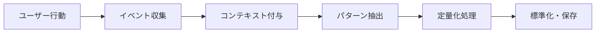

# 定量化フレームワークとデータ蓄積プロセス

## 1. 定量化レベルの階層構造

### 1.1 定量化の成熟度モデル

```
レベル1: 感覚的定量化
├── 個人の経験に基づく判断
├── 再現性: 低
└── 共有可能性: 限定的

レベル2: 部分的定量化
├── 特定の結果にのみ再現性
├── 再現性: 部分的
└── 共有可能性: 中程度

レベル3: 構造化定量化
├── 明確な測定基準
├── 再現性: 高
└── 共有可能性: 高

レベル4: 体系的定量化
├── 目的駆動の設計
├── 再現性: 完全
└── 共有可能性: 標準化
```

### 1.2 定量化プロセスの変換

```
情報化[a] → 定量化[b] → 再現可能性[c] → 共通化[d]
```

## 2. データ蓄積プロセス

### 2.1 基礎データ収集層

```typescript
interface BaseDataCollection {
  // ユーザー行動の生データ
  rawBehavior: {
    action: string;
    timestamp: Date;
    context: Record<string, any>;
    sessionId: string;
  };
  
  // 環境情報
  environment: {
    taskType: string;
    domainContext: string;
    userExperience: number;
  };
  
  // 結果データ
  outcome: {
    success: boolean;
    metrics: Record<string, number>;
    feedback: string;
  };
}
```

### 2.2 パターン認識層

```typescript
interface PatternRecognition {
  // 経験パターンの分類
  experiencePattern: {
    type: '同一事象' | '類似事象' | '類推可能' | '組み合わせ';
    confidence: number;
    historicalReference: string[];
  };
  
  // ヒューリスティック形成
  heuristicFormation: {
    trigger: string;
    decision: string;
    rationale: string;
    effectiveness: number;
  };
}
```

### 2.3 定量化変換層

```typescript
interface QuantificationTransform {
  // 感覚的指標の数値化
  sensoryMetrics: {
    original: string;  // "小さじ1杯程度"
    quantified: number;  // 5.0 (ml)
    variance: number;  // ±0.5
    calibrationMethod: string;
  };
  
  // 共通化指標
  standardMetrics: {
    metric: string;
    value: number;
    unit: string;
    referenceStandard: string;
  };
}
```

## 3. 実装アーキテクチャ

### 3.1 データ収集パイプライン



### 3.2 評価メトリクス体系

#### a) 再現性指標
- **完全再現率**: 同一条件下での結果一致率
- **部分再現率**: 類似条件下での傾向一致率
- **予測精度**: 新規状況での予測成功率

#### b) 共有可能性指標
- **言語化率**: 暗黙知から形式知への変換率
- **理解度**: 他者による再現成功率
- **標準化レベル**: 業界標準への準拠度

### 3.3 フィードバックループ

```typescript
interface FeedbackLoop {
  // 即時フィードバック
  immediate: {
    action: string;
    result: 'success' | 'failure' | 'partial';
    adjustment: string;
  };
  
  // 長期学習
  longTerm: {
    pattern: string;
    frequency: number;
    evolutionHistory: Array<{
      date: Date;
      modification: string;
      reason: string;
    }>;
  };
}
```

## 4. データ蓄積の具体的手順

### Step 1: 初期観察フェーズ
1. ユーザーの自然な行動を記録
2. コンテキスト情報を自動収集
3. 結果との相関を分析

### Step 2: パターン抽出フェーズ
1. 頻出パターンの識別
2. 成功/失敗パターンの分類
3. ドメイン固有の特徴抽出

### Step 3: 定量化フェーズ
1. 感覚的判断の数値マッピング
2. 統計的検証による閾値設定
3. 個人差の正規化処理

### Step 4: 標準化フェーズ
1. 共通メトリクスへの変換
2. ドキュメント化と可視化
3. 再現性テストの実施

### Step 5: 継続的改善フェーズ
1. フィードバックの収集と分析
2. モデルの更新と調整
3. 新規パターンの統合

## 5. ドメイン知識の構造化

### 5.1 接続可能領域の定義

```typescript
interface DomainConnection {
  // 直接関連領域
  directDomain: {
    name: string;
    relevance: number;  // 0-1
    sharedConcepts: string[];
  };
  
  // 間接関連領域
  indirectDomain: {
    name: string;
    bridgeConcepts: string[];
    transformationRequired: boolean;
  };
}
```

### 5.2 認知情報の定量化

```typescript
interface CognitiveQuantification {
  // 認知負荷
  cognitiveLoad: {
    complexity: number;  // 1-10
    familiarity: number;  // 0-1
    learningCurve: 'steep' | 'moderate' | 'gentle';
  };
  
  // 意思決定品質
  decisionQuality: {
    speed: number;  // ms
    accuracy: number;  // 0-1
    confidence: number;  // 0-1
  };
}
```

## 6. 実装例: HeuristicsAnalysisの拡張

```typescript
// fronter/src/model/heuristics.ts に追加
export interface QuantifiedHeuristicsAnalysis extends HeuristicsAnalysis {
  quantificationLevel: 1 | 2 | 3 | 4;
  
  dataCollection: {
    rawDataPoints: number;
    processingMethod: string;
    collectionPeriod: string;
  };
  
  metrics: {
    reproducibility: number;  // 0-1
    shareability: number;  // 0-1
    standardization: number;  // 0-1
  };
  
  patterns: {
    identified: string[];
    confidence: Record<string, number>;
    evolution: Array<{
      date: string;
      change: string;
      impact: number;
    }>;
  };
  
  domainContext: {
    primary: string;
    related: string[];
    transferability: number;  // 0-1
  };
}
```

## 7. データベーススキーマ設計

```sql
-- 定量化データテーブル
CREATE TABLE quantification_data (
  id SERIAL PRIMARY KEY,
  user_id INTEGER REFERENCES users(id),
  task_id INTEGER REFERENCES tasks(id),
  
  -- 生データ
  raw_value TEXT,
  raw_context JSONB,
  
  -- 定量化結果
  quantified_value DECIMAL,
  quantification_method VARCHAR(50),
  confidence_level DECIMAL,
  
  -- メタデータ
  domain VARCHAR(100),
  pattern_type VARCHAR(50),
  reproducibility_score DECIMAL,
  
  created_at TIMESTAMP DEFAULT CURRENT_TIMESTAMP,
  updated_at TIMESTAMP DEFAULT CURRENT_TIMESTAMP
);

-- パターン進化テーブル
CREATE TABLE pattern_evolution (
  id SERIAL PRIMARY KEY,
  pattern_id VARCHAR(100),
  version INTEGER,
  
  -- パターン情報
  pattern_description TEXT,
  trigger_conditions JSONB,
  expected_outcome JSONB,
  
  -- 効果測定
  success_rate DECIMAL,
  usage_count INTEGER,
  last_used TIMESTAMP,
  
  -- 進化履歴
  previous_version INTEGER,
  change_reason TEXT,
  
  created_at TIMESTAMP DEFAULT CURRENT_TIMESTAMP
);
```

## 8. 評価とモニタリング

### 8.1 KPI設定

1. **定量化成熟度KPI**
   - レベル3以上の定量化率: 目標70%
   - 再現性スコア平均: 目標0.8以上
   - 標準化達成率: 目標60%

2. **ユーザー価値KPI**
   - 意思決定時間の短縮: 目標30%削減
   - 予測精度の向上: 目標85%以上
   - 知識共有の活性化: 月間共有数20%増

### 8.2 継続的改善サイクル

```
計測 → 分析 → 仮説立案 → 実験 → 検証 → 標準化 → 計測
```

## 9. 今後の拡張計画

1. **機械学習モデルの統合**
   - パターン認識の自動化
   - 予測モデルの構築
   - 異常検知システム

2. **可視化ダッシュボード**
   - リアルタイム定量化状況
   - 個人/チーム比較分析
   - トレンド予測

3. **知識グラフの構築**
   - ドメイン間の関係性マッピング
   - 転移学習の最適化
   - エキスパートシステムへの発展

---

このフレームワークは、感覚的な判断から体系的な定量化への移行を支援し、個人の暗黙知を組織の形式知へと変換するプロセスを提供します。